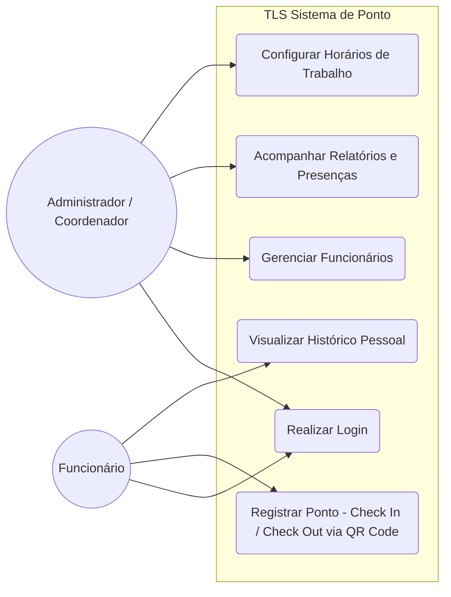
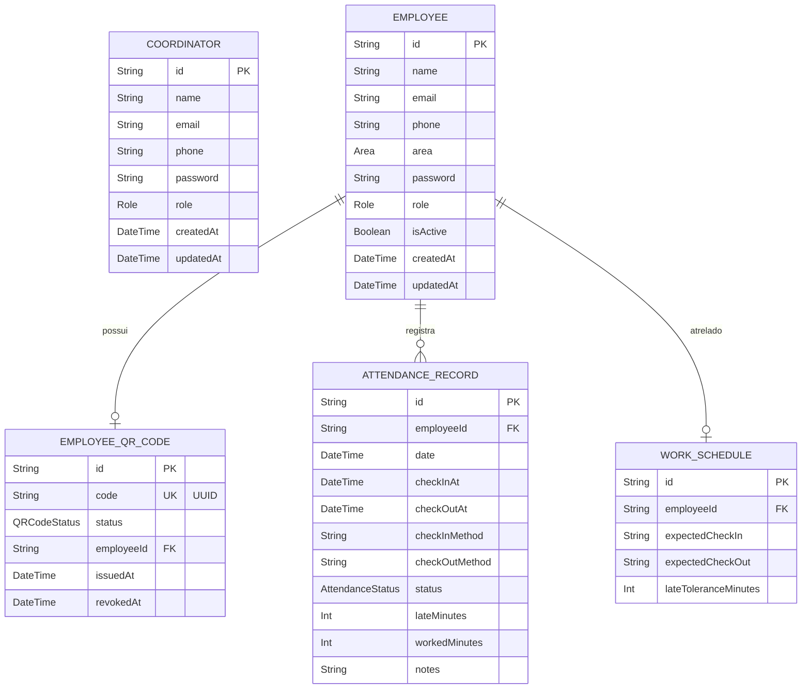
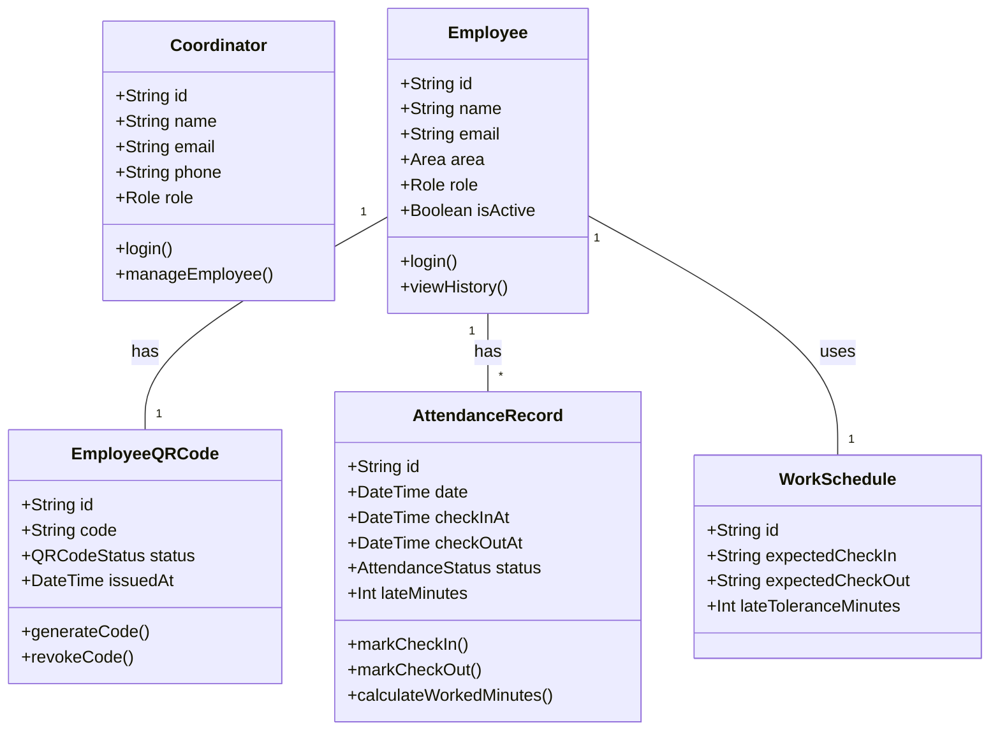
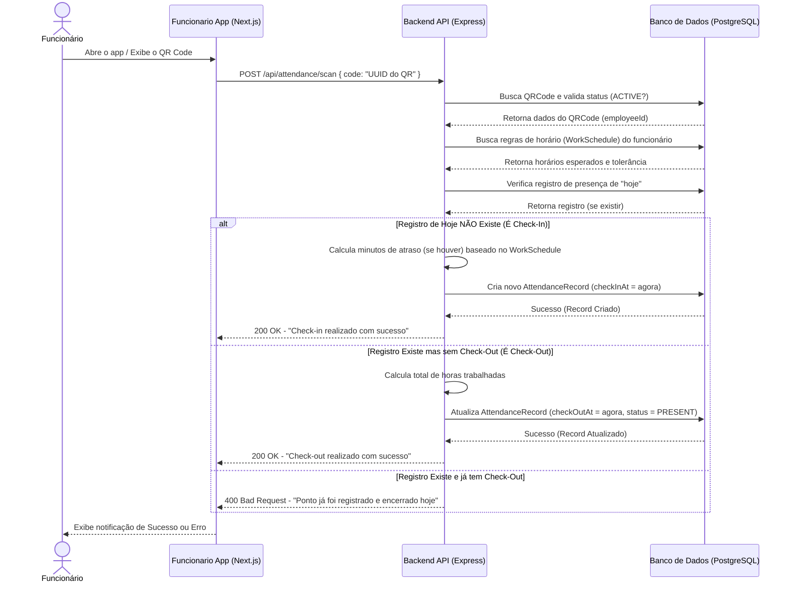

# Diagramas do Sistema (Controle de Ponto via QR Code)

Este documento centraliza todos os diagramas arquiteturais e estruturais que representam o funcionamento do sistema composto pelos módulos `admin`, `funcionario-app` e backend `qr-code`.

---

## 1. Diagrama de Casos de Uso
Demonstra as interações principais que os atores (Admin/Coordenador e Funcionário) possuem com o sistema.

---

## 2. Diagrama de Entidade e Relacionamento (ER / Banco de Dados)
Representação das tabelas no PostgreSQL (criadas via Prisma ORM) e suas relações.

---

## 3. Diagrama de Classes (Backend / Modelos de Domínio)
Apresenta a estrutura de classes de domínio inferidas a partir dos modelos de dados.

---

## 4. Diagrama de Sequência (Fluxo de Registro de Ponto via QR Code)
Descreve a sequência de eventos de quando o funcionário efetua o Check-in/Check-out.

